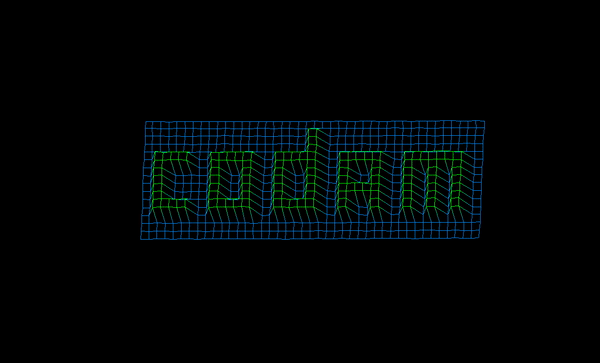

# FDF

In this project I discovered the basics of graphic programming, and in particular how
to place points in space, how to join them with segments and most importantly how to
observe the scene from a particular viewpoint.

The goal was to make 3D display of a given map. For bonus we could make it rotate and show it from different angles, parallel and isometric. Or to make it possible to adjust the size of the map and the depth of some of the given values. 

# How to compile and run the project on OS

# Create executable
```
make
```

# Run a given map
```
./fdf ./test_maps/codam.fdf
```

# Run a given map and see the menu for keyboard usage
```
./fdf ./test_maps/codam.fdf --menu
```


